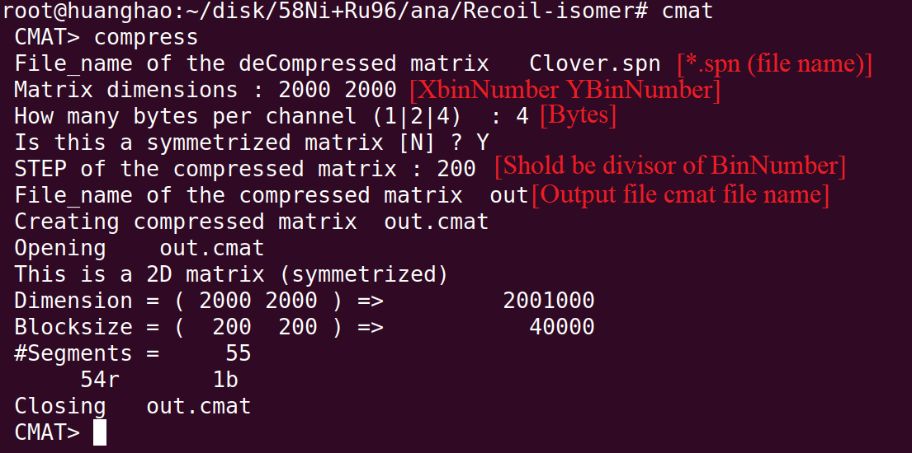
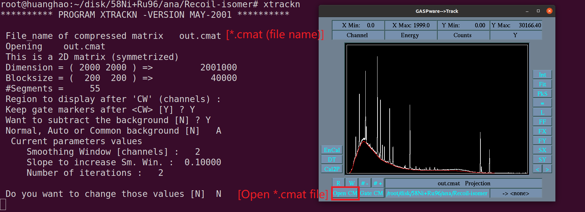

# [GASPware](https://github.com/sztaylor89/GASPware-1)

# Enviroment
  - export PATH=$PATH:/usr/local/EGASPware/bin
  - export GSDIR=/usr/local/EGASPware/etc

# [spn 文件生成](./Program/)

```cpp


void MakeSpn()
{
	// Open file and get histrgam
	TFile *ipf = new TFile("./Clover_g-g_matrix.root");
	TH2D *hggAll = (TH2D*)gROOT->FindObject("hggAll");
	// Get Bin number
    Int_t BinMax = hggAll->GetNbinsX();
	Int_t BytesPerChannel = 4; //bytes per channel 
    Int_t zmat[2000][2000] = {0};  // if Break here, ulimit -s 51200 in terminal
	// Get Count of each bin
    for(Int_t iy=1; iy <= BinMax; iy++)
    {
        for(Int_t ix=1; ix <= BinMax; ix++)
       	{
        	zmat[ix-1][iy-1] = (Int_t)hggAll->GetBinContent(ix, iy);
    	}
    }
	//Output  *.spn file
    FILE *fout;
    fout = fopen("out.spn", "wb+");  // b 二进制
    for(Int_t zi=0; zi<BinMax; zi++)
    	fwrite(zmat[zi], BytesPerChannel, BinMax, fout);
    fclose(fout);
	std::cout << "Xbins and Ybins are " << BinMax << "   " << BinMax << std::endl;
	std::cout << BytesPerChannel << " bytes per channel." << std::endl;
}

```

# Run
  - cmat (Make cmat file，在GASPware/bin目录下) 将spn二进制文件转换成cmat文件
   
   
  - xtrackn (Analyse data)
    -　CP: 寻峰 
    - 空格：选中范围
    - E:　放大
    - Gate
      - W: 选范围
      - WC: 开窗
    - 鼠标右击:　分割画布 
    - 清除　ZA + ZW    
   
